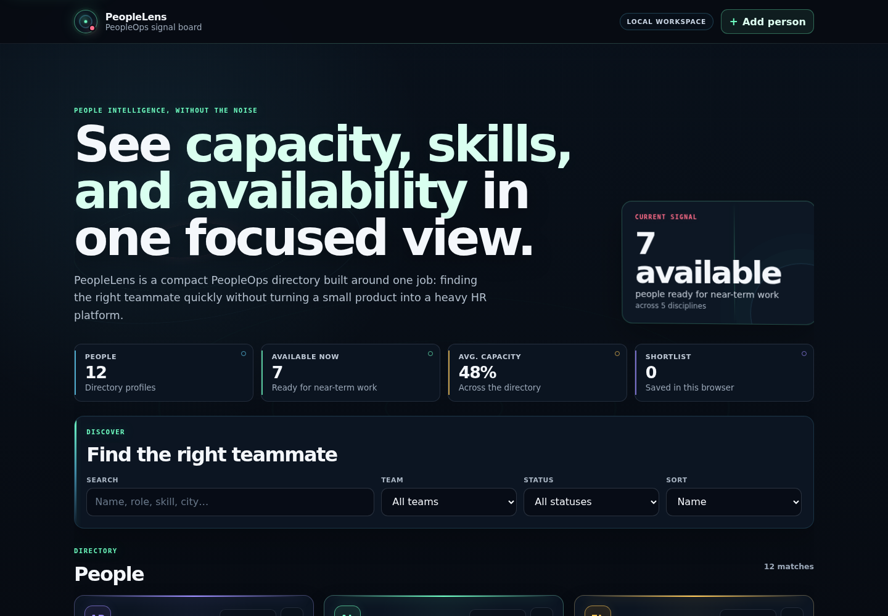

# PeopleLens — PeopleOps Directory

**A focused PeopleOps directory for finding teammates by role, skills, team, location, availability, and near-term capacity.**

Built with React around explicit state ownership, pure discovery logic, resilient local persistence, and accessible interaction.

[**Open the live demo →**](https://mykoladotsenko.github.io/people-lens/)

## Product capabilities

- full-directory search across names, roles, skills, teams, locations, and work modes
- team and availability filters
- deterministic sorting by name, capacity, team, or shortlist state
- browser-persisted shortlist
- add, edit, and delete locally managed people profiles
- locally managed profiles persist across reloads and immediately participate in stats, search, filters, and sorting
- live result count and clear empty-state recovery
- high-signal overview metrics
- responsive card layout for desktop and mobile
- reduced-motion and forced-colors support
- zero network dependency at runtime

The bundled seed profiles are **fictional demo data** and do not represent any real employer or personnel records. Profiles created through the UI stay local to the current browser.

## Stack

- React 19.3
- Vite 8.1
- modern CSS for the product surface
- Web Storage API
- Node.js built-in test runner
- ESLint
- GitHub Actions
- GitHub Pages

The application deliberately avoids a state library, router, component framework, API client, and backend because none are required for this product scope.

## Architecture

~~~text
React UI
  ├─> pure people selectors
  ├─> shortlist storage adapter
  └─> managed-people storage adapter

seed data + locally managed profiles ─> selectors ─> derived view ─> accessible components
~~~

The domain module is browser-agnostic. Search, filtering, sorting, stats, labels, and initials are pure functions and can be tested without React or the DOM.

Persistence is isolated behind defensive adapters. The shortlist and locally managed profiles are durable; temporary discovery state such as search and filters remains ephemeral.

See [ARCHITECTURE.md](./ARCHITECTURE.md) for the technical rationale and [DESIGN.md](./DESIGN.md) for the PeopleLens visual language and anti-sameness principles.

## Quality strategy

Run the full local gate:

~~~bash
npm ci
npm run check
~~~

That verifies:

1. ESLint with zero warnings
2. pure selector and persistence-boundary tests
3. production Vite build

GitHub Actions runs this gate on pull requests and before deploying the main branch to GitHub Pages. The pull-request gate also runs the Playwright browser and accessibility suite.

Unit coverage targets the behavior with the highest regression risk:

- cross-field search
- composable filters
- non-mutating sort
- shortlist-priority ordering
- deterministic metrics
- presentation helpers
- corrupted or stale persisted ids

## Accessibility

The UI includes:

- skip navigation
- semantic headings and landmarks
- fully labeled native search/select controls
- native meter elements for capacity
- explicit pressed state for shortlist actions
- action labels containing each person's name
- live result-count announcements
- strong keyboard focus
- reduced-motion support
- forced-colors fallbacks

## Product decisions

### Why a local workspace instead of a backend?

The bundled dataset remains fictional, while the UI now supports a realistic people-management workflow: users can create, edit, delete, shortlist, search, and filter profiles. Locally managed profiles persist in the browser, which keeps the demo self-contained without pretending there is an HR backend or shared multi-user database.

### Why keep discovery state ephemeral?

Profiles and shortlist choices represent durable user intent. Search terms and filters are temporary navigation state, so restoring them on every visit would make discovery less predictable.

### Why no global state library?

One screen owns a small amount of interaction state. React state plus pure derived selectors keeps ownership obvious and avoids ceremony.

## Run locally

~~~bash
npm ci
npm run dev
~~~

## Key implementation areas

For a focused implementation review:

1. [src/App.jsx](./src/App.jsx) — state ownership and composition
2. [src/domain/people.js](./src/domain/people.js) — pure discovery rules
3. [src/storage/pinnedStorage.js](./src/storage/pinnedStorage.js) — resilient shortlist persistence
4. [src/storage/peopleStorage.js](./src/storage/peopleStorage.js) — validation and persistence for locally managed profiles
5. [src/components/PersonDialog.jsx](./src/components/PersonDialog.jsx) — accessible create/edit/delete workflow
6. [src/components/EmployeeCard.jsx](./src/components/EmployeeCard.jsx) — directory card and management actions
7. [tests/](./tests/) and [e2e/](./e2e/) — domain, storage, browser, and accessibility regression coverage
8. [.github/workflows/quality.yml](./.github/workflows/quality.yml) — automated verification

## Repository evolution

PeopleLens began as a small React learning project. The current version narrows the repository around one coherent product flow: searchable people discovery, team and availability filtering, capacity signals, and a persisted shortlist.

Earlier tutorial-only tabs, timer side effects, the JSONPlaceholder demo, feedback exercises, and stale deployment metadata were removed when they no longer supported that product direction.

The result is one clear job, one authoritative data flow, and a smaller cognitive surface.
